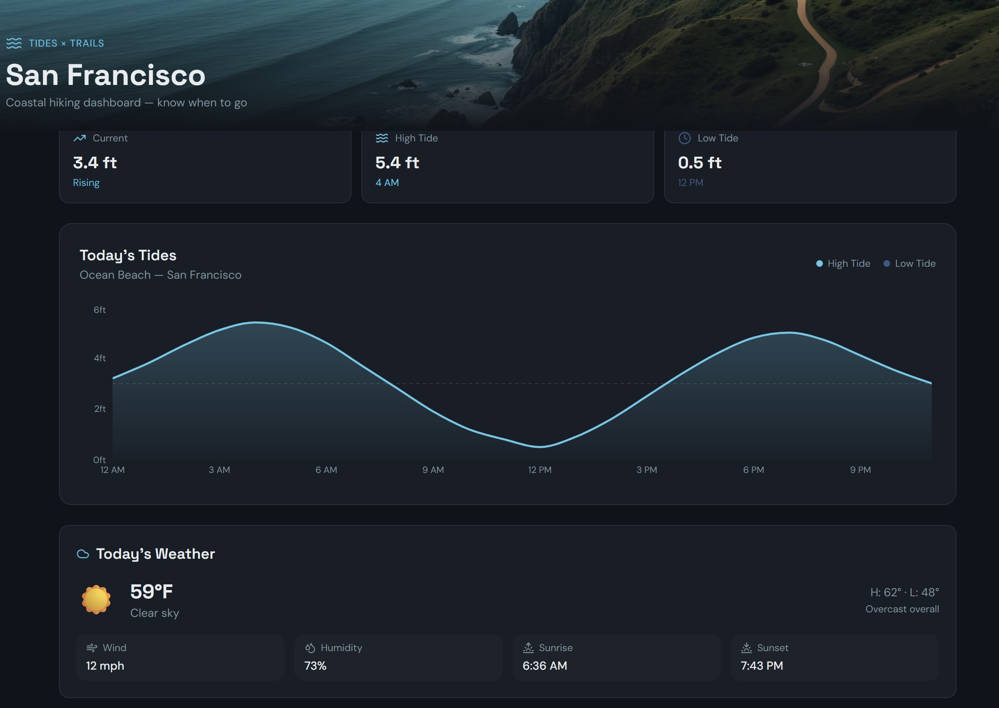
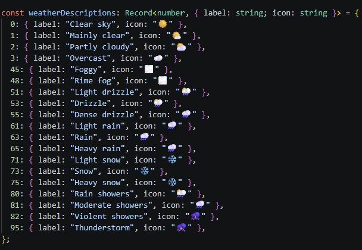

<h1 align="center">Loveable Application</h1>

<a align="center" href="" ></img></a>

## Description:
Loveable: Built a coastal dashboard with a deep ocean-themed design featuring tide charts (Recharts), current tide status cards, and 6 real SF hiking trails with tide-impact indicators. Trails like Lands End, Mile Rock Beach, and Battery to Bluffs are flagged as tide-dependent with recommended tide windows. Links to hiking trails.

## Technology Stack
- **Frontend/Client:** React.js, HTML5, CSS, Trailwind, etc...
- **API:** Toast, Open-meteo, Hiker API
- **Backend/Server:** node.js/express, vite, etc...

<h2 align="center">Video:</h2>

## Screen Shots:

Please reference the screenshot folder for more available images

## Run Code (Environment)

--------------------------
### Deployment

## Contact:
<!--- You can add in your linkedin, medium, stack overflow, dev.to account, etc. here --->
If you want to contact me you can reach me at <nelson@oakhalo.com>.

Connect with me on <a href="https://www.linkedin.com/in/ayla-nelson/">LinkedIn</a>

Connect with me on <a href="https://github.com/oakHalo">Oakhalo.dev</a>

## Resources:

- **PostMan** for API Tests [here](https://www.postman.com/)
    - jsonwebtoken / [jwt](https://jwt.io/) for Authentification & install [here](https://www.npmjs.com/package/jsonwebtoken)
- **Loveable** allows for website building [here](https://lovable.dev/dashboard?utm_device=c&utm_source=google&utm_medium=paid_search_branded&utm_campaign=google-us-b2c-prospecting-evergreen-subscription-US+-+Search+-+Lovable+-+CORE&campaignid=23072209374&gad_source=1&gad_campaignid=23072209374&gbraid=0AAAAA-iIxGdzJGcICe6xQlPapgap4Rn7e&gclid=Cj0KCQjwyr3OBhD0ARIsALlo-Om80pOY95zkaLzAgygqIFMminzutonqs0_rHHQbhTX3sL4NOrOhB9kaAhIYEALw_wcB)
    - The file can be downloaded which is better than Claude, which requires a higher level of customer level to download it. 
    - I love the fact that Loveable generated these amazing icons that can be used for the weather. The API generation is great, just a couple things on the backend that would be nice to brush up. Great for generic applications, will grab for other projects
    - Toast API [overview](https://doc.toasttab.com/doc/devguide/apiOverview.html) 
    - Tailwind design core themes [documentation](https://tailwindcss.com/docs/responsive-design)
    - Weather Data API [open source](https://open-meteo.com/en/docs), variables included in main page. Government data listed as references as well. 
        - Would recommend for future useage that is compatible with icons below: 

          <a align="center" href="" ></img></a>

#### **style:** 
- `frameworks and links associated`

- Filler Text [typographic](https://generator.lorem-ipsum.info/)
    - Lorem Ipsum 
- Google Fonts [here](https://fonts.google.com/)

#### **helpful hint:** 
- `useful hints for future projects to go faster`
- console log testing with `ctr-alt-l` 
- Always Stay Positive & Triple Check Permissions :)

<!-- 
### TODO stx: 
Future Structure (stx):
backend
frontend
images
screenShots [contains video link]
troubleShooting [contains issues resolved]
identify a HIKING API that can replace tides.ts = use actual data from API call, consider storing on backend

-->
