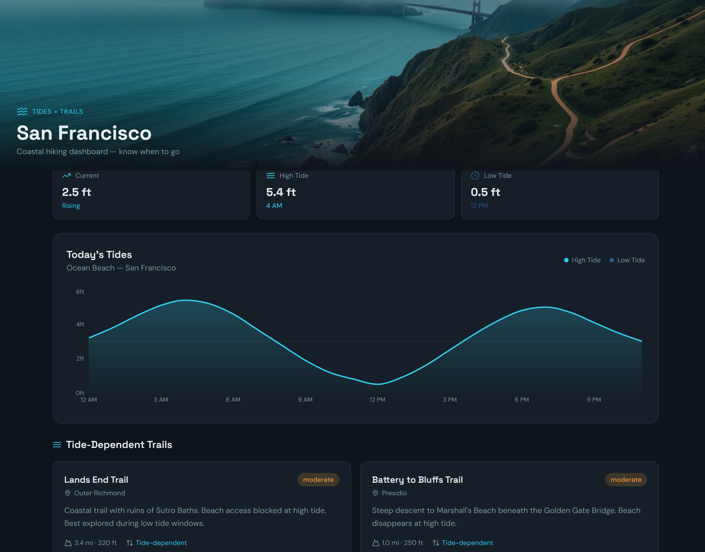

<h1 align="center">Loveable Application</h1>

<a align="center" href="" ></img></a>

## Description:
Loveable: Built a coastal dashboard with a deep ocean-themed design featuring tide charts (Recharts), current tide status cards, and 6 real SF hiking trails with tide-impact indicators. Trails like Lands End, Mile Rock Beach, and Battery to Bluffs are flagged as tide-dependent with recommended tide windows.


## Technology Stack
- **Frontend/Client:** React.js, HTML5, CSS, framework, etc.
- **API:** Api calls or external sources used
- **Backend/Server:** node.js/express or python alternatives, include databases

<h2 align="center">Video:</h2>

## Screen Shots:
<p align="center">Please reference the screenshot folder for more available images</p>

`selected image 1`

`selected image 2`

`selected image 3`

## Run Code (Environment)

### Front-End Instructions `<examples below>`
- confirm that config is appropriate:
```
> node -v
> npm -v
> git --version
```

- Initial package.json & install dependenies(localhost:3000):
    - Must be `cd`'d into frontend/client for install
    - MUI, `react-router-dom`, redux, formik, etc... (see resources)
```
> npx create-react-app <project name>
> cd <project name>
> npm install @mui/icons-material @mui/material @emotion/styled @emotion/react
> npm install --save react-router-dom
> npm install react-redux @reduxjs/toolkit
> npm install formik yup dotenv react-responsive-carousel
> npm install --save @stripe/react-stripe-js @stripe/stripe-js
```
- Test front-end once pages are generated (ctrl-c to exit):
```
> npm run start
```

### Back-End Helpful Instructions `<examples below>`
- Initial package.json & install dependencies:
    - Must be `cd`'d into backend/server for install
```
> npx create-strapi-app@latest <project name>
> cd <project name>
> npm install --save stripe
```
- Strapi Database generated (ctrl-c to exit):
```
> npm run develop
```
- **Avoid** *npm run start* and use the `npm run develop`. 
- Allow server to restart with each edit (see resources): 
    - **Content-Type Builder**: Item entry
    - **Media Library**: upload photos
    - **Permissions**: Settings > Roles > Public
- When using .env variables remember to [install prior](https://www.npmjs.com/package/dotenv/v/14.0.0)
```
npm install dotenv --save
```
-
    - Create a .env file in the root directory of your project.
    - Import and configure dotenv.
    - Establish a .gitignore [here](https://git-scm.com/docs/gitignore)

- In frontend fetch `item` from backend (*localhost:1337*):
```
const grouping = "items"
const items = await fetch(
`http://localhost:1337/api/${grouping}`
)
```
--------------------------
### Deployment


## Contact:
<!--- You can add in your linkedin, medium, stack overflow, dev.to account, etc. here --->
If you want to contact me you can reach me at <nelson@oakhalo.com>.

Connect with me on <a href="https://www.linkedin.com/in/ayla-nelson/">LinkedIn</a>

Connect with me on <a href="https://github.com/oakHalo">Oakhalo.dev</a>

## Resources:

- `Tech used and links associated`
- `Tech used and links associated`

`<examples below>`
- **PostMan** for API Tests [here](https://www.postman.com/)
    - jsonwebtoken / [jwt](https://jwt.io/) for Authentification & install [here](https://www.npmjs.com/package/jsonwebtoken)
- **Loveable** allows for website building [here](https://lovable.dev/dashboard?utm_device=c&utm_source=google&utm_medium=paid_search_branded&utm_campaign=google-us-b2c-prospecting-evergreen-subscription-US+-+Search+-+Lovable+-+CORE&campaignid=23072209374&gad_source=1&gad_campaignid=23072209374&gbraid=0AAAAA-iIxGdzJGcICe6xQlPapgap4Rn7e&gclid=Cj0KCQjwyr3OBhD0ARIsALlo-Om80pOY95zkaLzAgygqIFMminzutonqs0_rHHQbhTX3sL4NOrOhB9kaAhIYEALw_wcB)
    - The file can be downloaded which is better than Claude, which requires a higher level of customer level to download it. 


#### **style:** 
- `frameworks and links associated`

- Filler Text [typographic](https://generator.lorem-ipsum.info/)
    - Lorem Ipsum 
- Google Fonts [here](https://fonts.google.com/)

#### **helpful hint:** 
- `useful hints for future projects to go faster`
- console log testing with `ctr-alt-l` 
- Always Stay Positive & Triple Check Permissions :)


<!-- 
### TODO stx: 
Future Structure (stx):
backend
frontend
images
screenShots [contains video link]
troubleShooting [contains issues resolved]


-->
